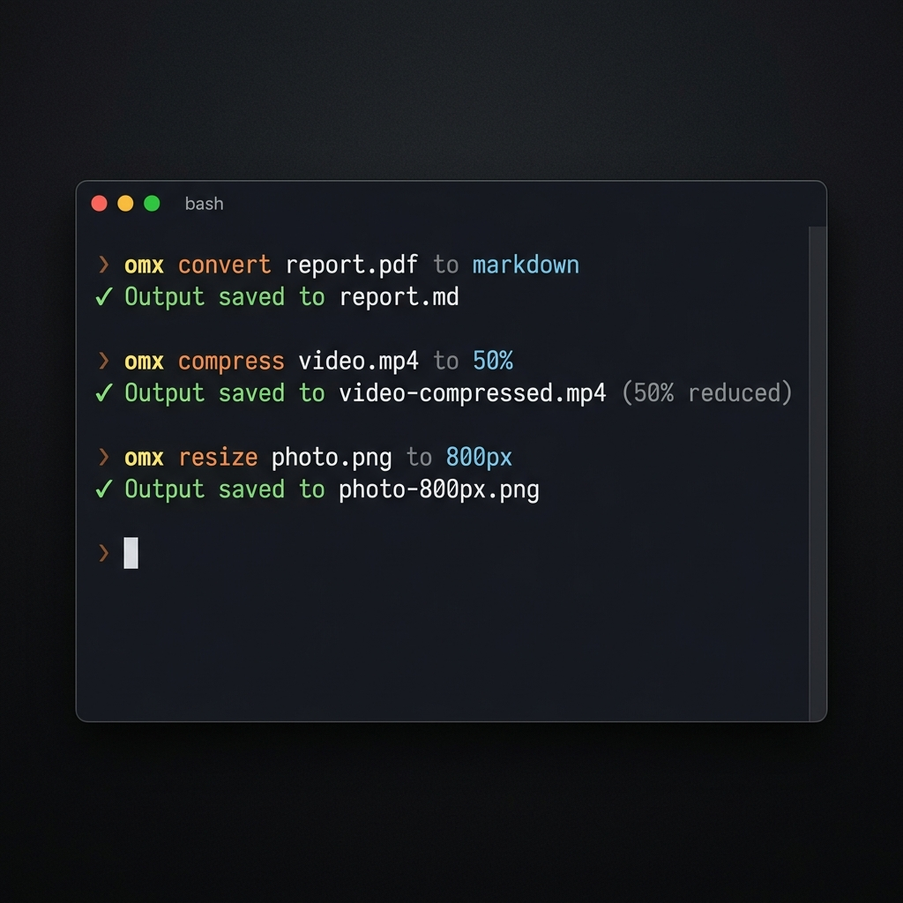

# OmniCommand (`omx`)



[](https://www.npmjs.com/package/omx-cmd)
[](https://github.com/Rishet11/OmniCommand/blob/main/LICENSE)
[](https://nodejs.org)
[](https://www.npmjs.com/package/omx-cmd)

OmniCommand is a local-first file conversion CLI. The npm package is `omx-cmd`; the installed terminal command is `omx`.

It routes documents, images, audio, and video through the right engine with plain commands like `omx convert report.pdf to markdown`, without requiring users to memorize FFmpeg, Sharp, Pandoc, or PDF extraction flags.

## Installation

```bash
npm install -g omx-cmd
omx doctor
```

Requires Node.js >= 20.3.0. Standard conversion is free and offline by default.

## Commands

```bash
# Convert
omx convert report.pdf to markdown
omx convert photo.png to webp
omx convert footage.mov to mp4

# Compress
omx compress video.mp4 to 50%
omx compress photo.png to 50%
omx compress archive.pdf to 200kb

# Trim and extract
omx trim podcast.mp3 from 0:30 to 1:45
omx extract audio from recording.mp4

# Resize
omx resize photo.png to 800px
```

PNG compression automatically writes WebP output because PNG is lossless and usually cannot be meaningfully recompressed as PNG.

## Batch Operations

All file-processing commands accept multiple input files before the natural-language separator:

```bash
omx compress *.png to 80% --dry-run
omx convert ./docs/*.pdf to markdown --json
omx resize image-1.jpg image-2.jpg to 1200px
omx trim *.mp4 from 0:10 to 0:45
omx extract audio from *.mov
```

Batch jobs continue when one file fails, then print a summary. Exit code is `0` only when all files succeed or the command is a graceful no-op; it is `1` when any runtime failure occurs.

## Supported Formats

| Engine | Input formats | Output formats |
|---|---|---|
| Sharp | jpg, jpeg, png, webp, avif, gif, tiff, bmp, ico | jpg, png, webp, avif, gif |
| FFmpeg | mp4, mov, avi, mkv, webm, flv, 3gp, mp3, wav, aac, flac, m4a, ogg, opus | FFmpeg-supported formats |
| pdfjs-dist | pdf | md, txt |
| Pandoc | docx, doc, pptx, xlsx, rtf, txt, md | Pandoc-supported formats |

Pandoc is optional and only needed for non-PDF document conversion. Local PDF conversion supports Markdown/text extraction. Use `--refine` for scanned PDFs or richer layout recovery.

## AI OCR and Optional Packages

`--refine` uploads the document to Gemini Vision OCR. It is opt-in and requires a Gemini API key:

```bash
omx config set GEMINI_API_KEY your-api-key-here
omx convert scanned-report.pdf to markdown --refine
```

Gemini and MCP dependencies are optional/lazy-loaded. If your package manager omits optional dependencies and you need AI OCR or MCP, install with:

```bash
npm install -g omx-cmd --include=optional
```

## Flags

| Flag | Effect |
|---|---|
| `--json` | JSON-only stdout for scripts and agents |
| `--quiet` | Suppress progress and human output |
| `--overwrite`, `-y` | Allow overwriting existing output files |
| `--dry-run` | Preview output paths/commands without writing files |
| `--verbose` | Show input/output sizes after completion |
| `--no-color` | Disable ANSI color; also respects `NO_COLOR` |
| `--refine` | Convert PDFs through Gemini OCR; convert command only |

Long FFmpeg jobs show terminal progress with percent, output size, and ETA when duration is known. Progress is suppressed for `--json`, `--quiet`, non-TTY output, and dry runs.

## JSON Output

Single-file JSON success:

```json
{
  "success": true,
  "inputFile": "/path/to/input.png",
  "outputPath": "/path/to/input_compress.webp",
  "action": "compress"
}
```

Batch JSON success:

```json
{
  "success": true,
  "action": "compress",
  "results": [
    {
      "inputFile": "/path/to/a.png",
      "outputPath": "/path/to/a_compress.webp",
      "success": true
    }
  ],
  "summary": {
    "total": 1,
    "succeeded": 1,
    "failed": 0,
    "skipped": 0
  }
}
```

## Shell Completions

```bash
# bash
omx completion bash >> ~/.bashrc

# zsh
omx completion zsh > ~/.zsh/completions/_omx

# fish
omx completion fish > ~/.config/fish/completions/omx.fish
```

## Output Naming

Outputs are written next to the input file:

| Action | Suffix |
|---|---|
| convert | `_convert` |
| compress | `_compress` |
| trim | `_trim` |
| extract | `_extract` |
| resize | `_resize` |

Example: `photo.png` with `omx compress photo.png to 50%` writes `photo_compress.webp`.

## Exit Codes

| Code | Meaning |
|---|---|
| `0` | Success or graceful no-op |
| `1` | Runtime error, dependency failure, corrupt file, or partial batch failure |
| `2` | User input error such as bad syntax or missing arguments |

## MCP Server

OmniCommand includes an optional MCP server for agentic integrations:

```bash
node /path/to/omx-cmd/dist/mcp.js
```

Transport is stdio. Tools exposed: `convert`, `compress`, and `trim`.

## 📖 Advanced Usage

For detailed information on the Programmatic API, MCP Server setup, and full CLI flag reference, see the **[DOCS.md](./DOCS.md)**.

---

## 📂 Developer Notes

The CLI package lives in `cli/`. The root React/Vite app is a marketing/demo page, not a hosted converter product.

```bash
cd cli
npm install
npm run build
npm test
```

See [CONTRIBUTING.md](./CONTRIBUTING.md) for contributor guidance.
